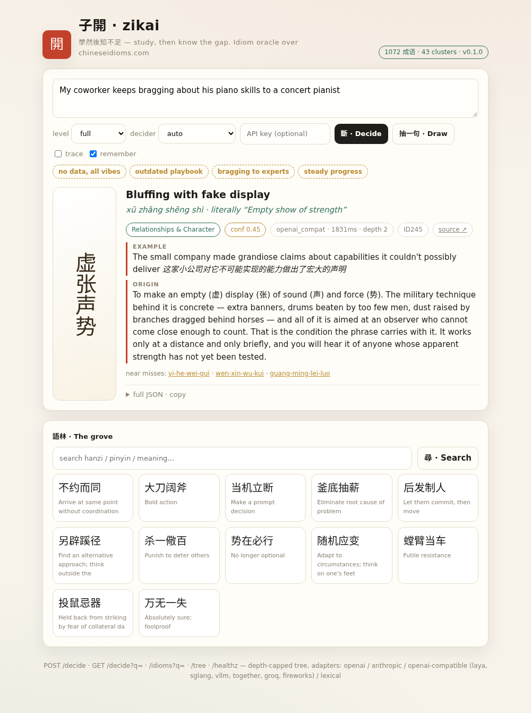

# 子開 zikai — the idiom oracle

[](pyproject.toml)
[](docs/integrations/README.md)

> 子使漆雕開仕。對曰：「吾斯之未能信。」子說。
> *The Master urged Qidiao Kai to take office. "I have not yet made my
> study trustworthy," he replied — and the Master was pleased.* (Analects 5.20)
>
> 是故學然後知不足。*Only after studying does one know one's own gap.* (學記, Book of Rites)

This service is named after 子開 (Qidiao Kai, 漆雕開), the disciple who
declined a government post rather than answer before he was ready. An oracle
named for a man who refused premature answers: the `confidence` field and the
trace mode are that refusal encoded — the service always tells you how little
it is sure of.

[](dashboard/index.html)

**zikai** maps the [chineseidioms.com](https://www.chineseidioms.com) chengyu
corpus (1072 idioms, hydrated) into a **shallow clustered decision tree**
and serves it behind a **decisions-style API**: text in → the single most
applicable idiom out, fully hydrated (hanzi, pinyin, literal + metaphoric
meaning, origin, examples, FAQ, related idioms).

## Why shallow (the design law)

Every extra tree level is a latency tax and an error multiplication. Two
model calls — *theme*, then *cluster* — then the final pick is a
**retrieval+rerank scoring stage**, not a third question. Routing answers
guide (boost) retrieval but can never evict the right idiom before the
decider sees it: the shortlist is retrieved over the whole corpus, widened
by one semantic keyword-expansion hop from the decider.

```
text ──Q1 theme──► 5 themes ──Q2 cluster──► 43 clusters
     └► keyword expansion ─► global lexical retrieval (top-12) ─► decider rerank ─► winner
                                                          depth capped at 2
```

## Quick start

```bash
python -m venv .venv && .venv/bin/pip install -e .[dev]
zikai build                # records.jsonl -> corpus.json + decision_tree.json
zikai serve --port 8077    # API + dashboard at http://localhost:8077/
zikai decide "He bragged to the master" --level text
pytest                     # 64 tests, zero keys required (lexical decider)
```

## Endpoints

| | |
|---|---|
| `POST /decide` | `{"text": "...", "level": "full\|compact\|text\|slug", "decider": "...", "extras": ["origin"], "trace": true, "related_resolved": true}` |
| `GET /decide?q=` | same, GET-friendly (`?key=*** for health checks) |
| `POST /v1/decisions` | vendor-flavoured alias, same body |
| `GET /idioms/{slug}` | hydrated record by slug (`?level=`, `?related=true`) |
| `GET /idioms?q=` | lexical search (hanzi/pinyin/meaning/slug) |
| `GET /tree` | the clustered decision tree as data |
| `GET /stats` · `GET /healthz` | corpus/adapter stats, liveness |
| `GET /` | the dashboard |

Auth: any of `Authorization: Bearer`, `x-api-key`, or `?key=*** compared
against `ZIKAI_API_KEYS` (comma-separated). Leave it unset to run open.

## Decider adapters (providers)

One normalized shape — *(text, question, options) → value* — vendors
pluggable at request time (`"decider": "..."`) or by env. Every row is a
`PROVIDER_PRESETS` entry in `zikai/adapters.py`. Honest statuses: **wired** =
adapter class + resolution path exist and are exercised by the offline suite
(64 tests, no network); **preset** = table row that `resolve_adapter` builds
on the fly once its key env is set — built from vendor docs, never
live-key-tested; **experimental** = table-only row whose transport
(`/v1/decisions`, `/v1/systemone`, `/responses`) has no adapter class yet, so
it can never dial out and resolve falls through to auto/lexical. Nothing here
has been dialed against a live vendor key.

Dedicated decision engines:

| name | transport | env var | status |
| --- | --- | --- | --- |
| laya | openai_compat | `LAYA_BASE_URL` / `LAYA_MODEL` / `LAYA_API_KEY` | preset † |
| anyjev | openai_compat | `ANYJEV_BASE_URL` / `ANYJEV_MODEL` | preset |
| jeff | openai_compat | `JEFF_BASE_URL` / `JEFF_MODEL` | preset |
| kev | openai_compat | `KEV_BASE_URL` / `KEV_MODEL` / `KEV_API_KEY` | preset |
| vllm-constrained-choice | openai_compat (guided-choice hook not added) | `ZIKAI_LAYA_BASE_URL` / `ZIKAI_LAYA_MODEL` | preset |
| jev-typesafe | decisions_api (`/v1/systemone`) | `TYPESAFE_API_KEY` | experimental |
| perplexity-decisions | decisions_api (`/v1/decisions`) | `PERPLEXITY_API_KEY` | experimental |
| openai-decisions | openai (preview; no published model id) | `OPENAI_API_KEY` | experimental |

General fallbacks:

| name | transport | env var | status |
| --- | --- | --- | --- |
| openai | chat completions | `ZIKAI_OPENAI_API_KEY` | wired |
| anthropic | Messages API | `ZIKAI_ANTHROPIC_API_KEY` | wired |
| lexical | zero-key Dice fallback | — | wired |
| openai_compat (auto lane) | any chat-completions endpoint | `ZIKAI_LAYA_BASE_URL` (e.g. `http://host:18030/v1`) | wired |
| openai_responses | responses (`/responses`) | `OPENAI_API_KEY` | experimental |
| gemini | openai_compat | `GEMINI_API_KEY` | preset |
| venice | openai_compat (doc-example model UNVERIFIED) | `VENICE_API_KEY` | preset |
| anthropic-3-5-haiku / -sonnet | anthropic (retired upstream; pin-compat rows) | `ANTHROPIC_API_KEY` | preset |
| sglang / vllm / ollama / together / groq / fireworks / deepseek | alias rows over openai_compat / openai | — (pick up the configured adapter) | preset †† |

Rerankers (opt-in recall stage; off unless `ZIKAI_RERANK_TRANSPORT` names a
row **and** its key env is set; fail-open — a miss keeps the lexical order):

| name | transport | env var | status |
| --- | --- | --- | --- |
| cohere_rerank | cohere `/v2/rank` | `CO_API_KEY` + `ZIKAI_RERANK_TRANSPORT=cohere_rerank` | wired |
| jina_rerank | jina `/v1/rerank` | `JINA_API_KEY` + `ZIKAI_RERANK_TRANSPORT=jina_rerank` | wired |

Gateways:

| name | transport | env var | status |
| --- | --- | --- | --- |
| openrouter | openai_compat | `OPENROUTER_API_KEY` | preset |
| vercel_ai_gateway | openai_compat | `AI_GATEWAY_API_KEY` | preset |

† laya's chat-compat leg is UNVERIFIED against the native `/v1/systemone`
shape (per recon). †† alias rows carry no base/model of their own (old
`_ALIAS` semantics): they only route to an adapter that's already configured
on that transport, never built on the fly. `ZIKAI_API_KEYS` lists the keys
*this API* accepts; it is not a vendor credential.

```bash
export ZIKAI_LAYA_BASE_URL=http://192.168.0.122:18030/v1  # zero-cent substrate
export ZIKAI_OPENAI_API_KEY=***                            # premium rerank lane
export ZIKAI_API_KEYS=zk-public-1,zk-partner-2             # keys YOU accept
```

**A failed vendor call percolates nowhere: each node falls back to lexical,
so the API never returns 500 because a vendor sneezed.**

## Response levels

- `full` — everything: hanzi, pinyin, literal + metaphoric meaning, origin,
  examples (en/zh), FAQ, related slugs, term code, source URL, provenance
  (`decision_path`, `cluster`, `runner_ups`, `confidence`, `latency_ms`)
- `compact` — decision essentials
- `text` — one line: `按部就班 (àn bù jiù bān) — Follow established procedures [slug]`
- `slug` — machine-to-machine minimal
- `extras:["origin","faq"]` force-include any meta field;
  `related_resolved:true` hydrates related slugs into `{slug,hanzi,meaning}`.

## Nightly mapping refresh

`pipeline/` is robots.txt-respecting (only `/api/` is disallowed),
lastmod-incremental, 0.45s/request politeness, UA-declared.

```bash
zikai nightly --push    # resync sitemaps → scrape changed → rebuild → git push data
```

The data artifacts (`corpus.json`, `decision_tree.json`, `records.jsonl`)
are committed with date-stamped snapshot commits so the mapping history is
reviewable per-night. Schedule with cron/systemd:

```cron
17 5 * * * cd /path/to/zikai && .venv/bin/zikai nightly --push >> data/nightly.log 2>&1
```

## Dashboard

`GET /` — rice-paper + vermillion, seal-script 開 stamp, vertical hanzi
card, one-click test situations, near-miss drilldown, session history,
random **抽一句 Draw**, grove search by hanzi/pinyin/meaning, raw-JSON
copy, `Ctrl/Cmd+Enter` to decide. No build step, one HTML file, no CDN.

## Repo layout

```
zikai/            app.py (API) engine.py (tree walk) adapters.py (vendor layer)
                  tree.py (cluster build) shapes.py (levels) config.py cli.py
pipeline/         collect_slugs.py (sitemap) scrape.py (hydrating scraper)
data/             records.jsonl corpus.json decision_tree.json (refreshed nightly)
dashboard/        index.html
tests/            64 tests, no keys needed
```

## Harness adapters (one core, three spins)

`zikai/client.py` is the ONLY code that knows how to talk to an endpoint
(env: `ZIKAI_URL`, `ZIKAI_KEY` — the whole harness contract; stdlib, one
retry, one timeout, one formatter `line()`). Adapters import it and nothing
else:

| adapter | what it does | wiring |
|---|---|---|
| `adapters/git-prepare-commit-msg/` | every commit ends with `Zikai: 刻舟求劍 (kè zhōu qiú jiàn) — …` | `ln -sf …/zikai-prepare-commit-msg.sh .git/hooks/prepare-commit-msg` |
| `adapters/alertmanager-webhook/` | pager groups arrive with an idiom epigraph (`commonAnnotations.zikai`) | AM receiver webhook → shim → your ntfy bridge |
| `adapters/receipt-header/zk-quote.py` | opens postmortems/receipts with the oracle's blockquote | paste or pipe |

All three are silent-failure by design: oracle down => no decoration, payload
proceeds. A poet that holds the press is worse than no poet. Contract-tested
in `tests/test_adapters.py` — core drift reds all three there, not in someone's
terminal. (Peer spins welcome on the same rule: if an adapter needs a second
helper, the helper is in the wrong file.)

## Providers & interfaces

Decider providers (who answers the tree's questions): the tables above —
**wired** rows are exercised offline, **preset** rows are table entries
never dial-tested, **experimental** rows can never dial out.

Client interfaces (how your harness reaches the oracle): all 24, indexed
with statuses in [docs/integrations/README.md](docs/integrations/README.md)
— agent harnesses (Hermes, Pi, Claude Code, Codex, OpenClaw, Gemini CLI,
Cursor, Copilot, OpenCode, Cline, Cascade, Amp), SDK tool wrappers
(LangChain, OpenAI Agents, PydanticAI, CrewAI, Vercel AI, LlamaIndex,
Claude Agent SDK, Google ADK), and services (n8n, Open WebUI, ChatGPT, MCP).

## Honesty notes

- Corpus fields are copied verbatim from source JSON-LD/rendered sections;
  the service never invents metadata. Source attribution rides in every
  record (`url`, `term_code`).
- `confidence` is the lexical score of the winner, floored at 0.45 when a
  remote decider confirmed the pick — an honest instrument, not a probability.
- Self-tested eval: hanzi-echo probes 5/5 (CJK char-overlap bridges
  simplified/traditional in the ranker); plain-scenario adversarial tail
  3/5 on the free local decider — remaining misses are near-synonym theft,
  trace shows the whole shortlist so you can judge the machine's judgment.

*子開: 學然後知不足 — the answer is the beginning of the study, not the end.*
